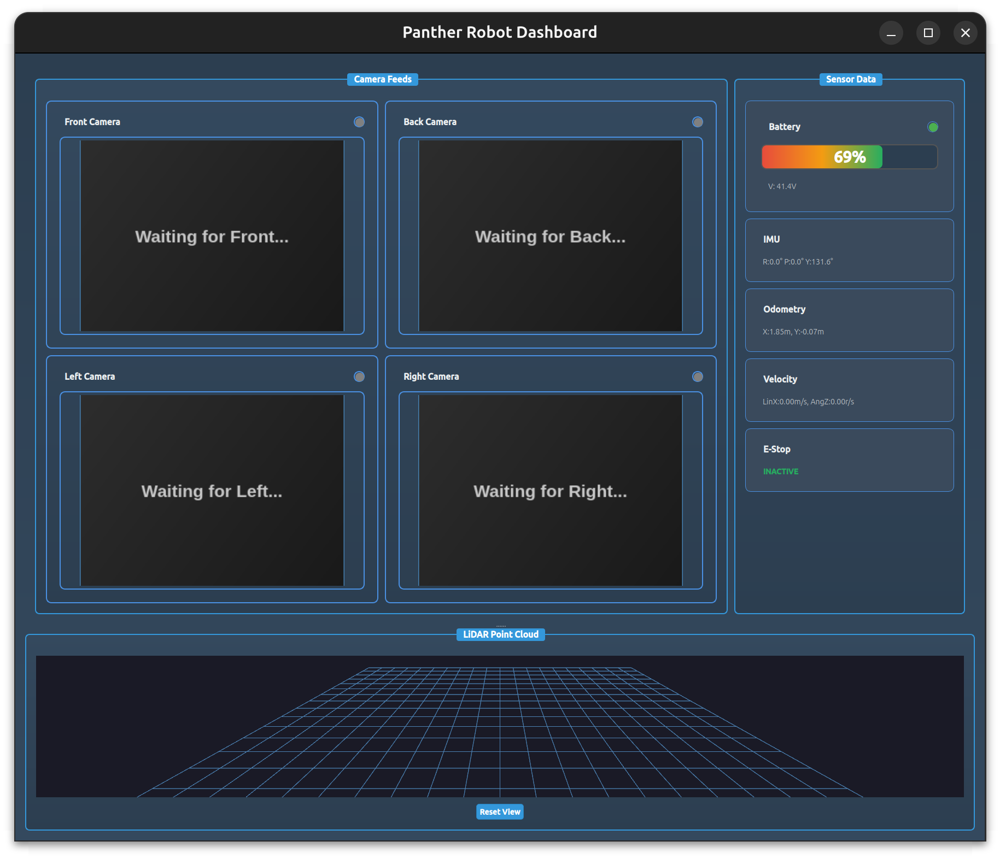
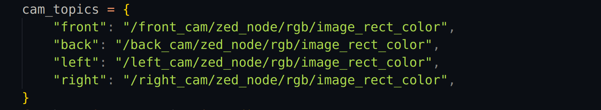

# Panther Dashboard GUI

## Introduction

This is a Python-based GUI package designed for the Panther robot's dashboard in ROS 2. It integrates multiple components including video feeds, sensor data, and robot velocity control into a unified graphical interface.

## System Requirements

This package is compatible with:
- **Ubuntu 24.04**
- **ROS 2 Jazzy**

**Dependencies:**
- PyQt5
- OpenCV (`cv2`)
- VTK
- ROS 2 packages (e.g., `sensor_msgs`, `geometry_msgs`, `rclpy`, etc.)
## Installation

### 1. Install Dependencies

```bash
sudo apt install python3-pyqt5 ros-jazzy-cv-bridge

pip install opencv-python vtk
```

### 2. Clone & Build

```bash
cd ~/ros2_ws/src

#---Option A: Use HTTPS with a GitHub Token---
#Generate a GitHub Personal Access Token (PAT) and run:
git clone https://<USERNAME>:<TOKEN>@github.com/MindCloud-Team/RosTest_GUI.git

#---Option B: Use SSH (Recommended for Private Repos)---
#If you’ve set up SSH keys with GitHub:
git clone git@github.com:MindCloud-Team/RosTest_GUI.git

cd ~/ros2_ws

colcon build

source install/setup.bash
```

## Running the GUI

Make sure your robot or simulation is publishing the required topics. Then launch the GUI with:

```bash
QT_QPA_PLATFORM=xcb python3 <full file destination>
```

> Ensure ROS 2 is properly sourced before launching.

##  Features

-  Battery status (percentage + voltage)
-  IMU orientation display (Roll, Pitch, Yaw)
-  Odometry position tracking
-  E-Stop indicator
-  Multi-camera feed viewer (Front, Back, Left, Right)
-  3D LiDAR point cloud visualization
-  Teleoperation using `W`, `A`, `S`, `D`
  

## Teleop Keys

| Key | Action        |
|-----|---------------|
| W   | Move forward  |
| S   | Move backward |
| A   | Turn left     |
| D   | Turn right    |

## Screenshot / Demo



## To Change Subscribed Topics
the following topics can be changed to display different topics:




## Tested On

- Ubuntu 24.04
- ROS2 Jazzy
- Panther robot (Husarion) simulated

## Authors

- Mind Cloud Team 
